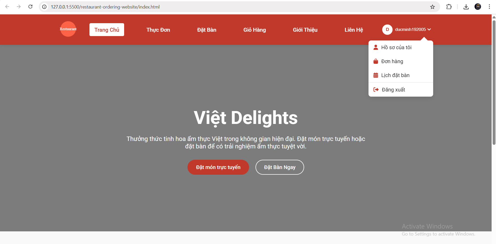
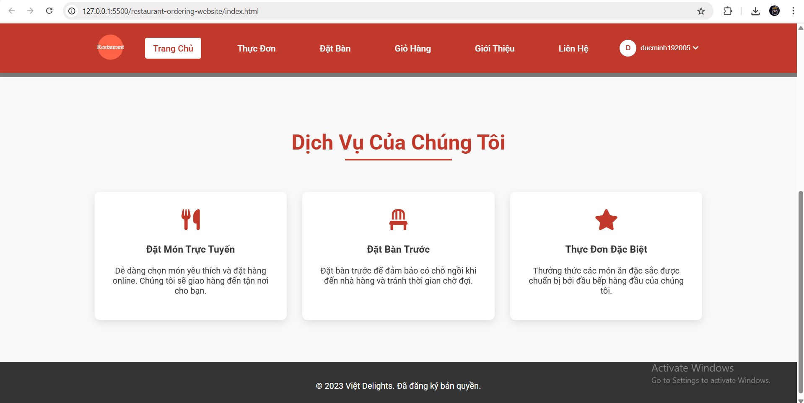
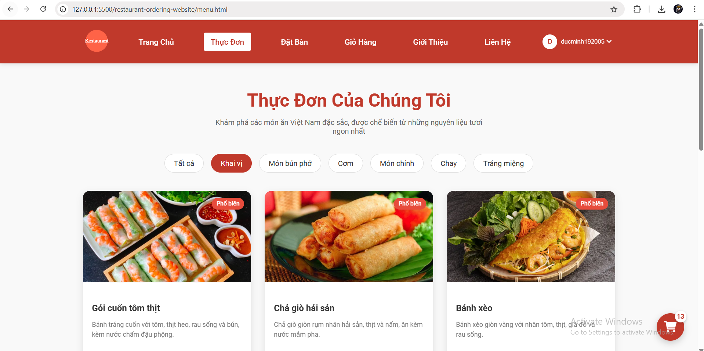
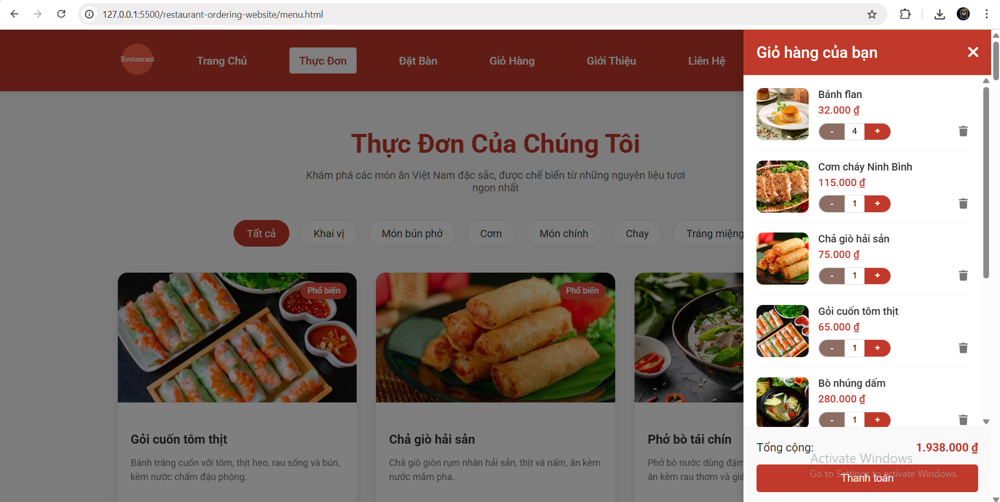
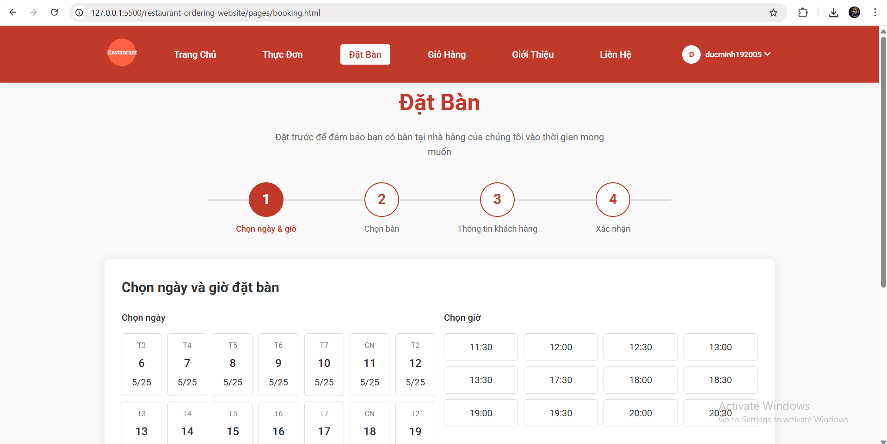
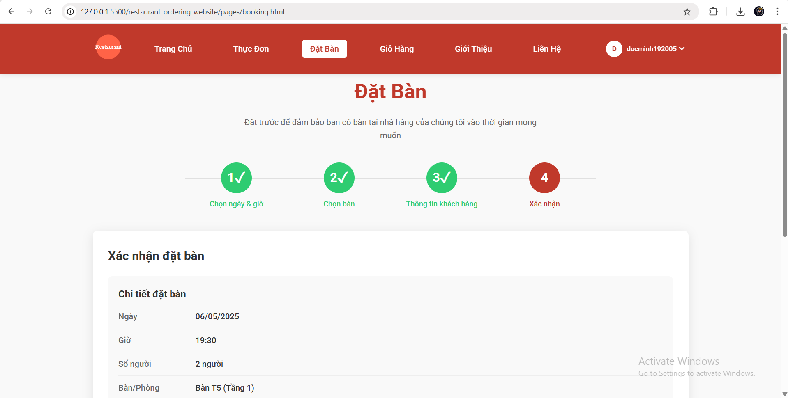
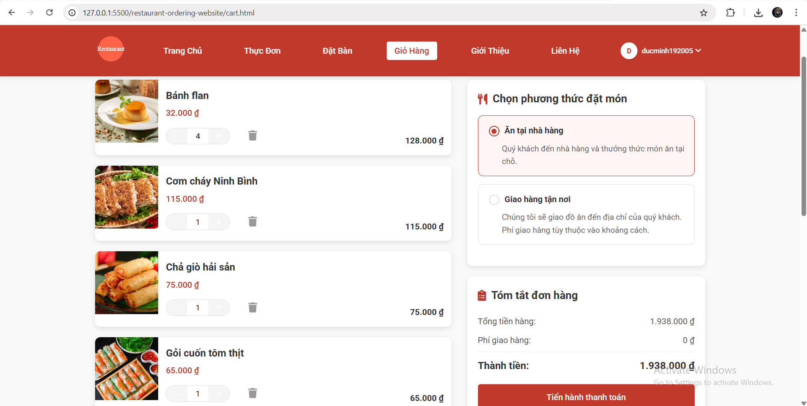
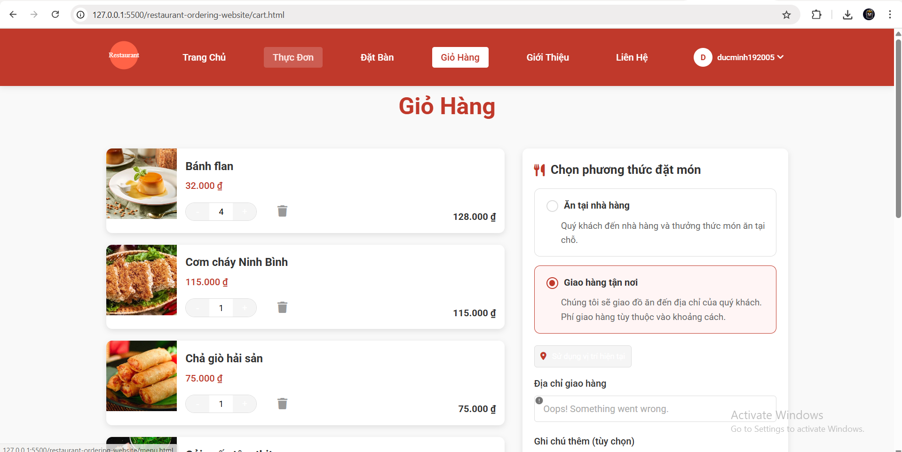

# 🍽️ Website Đặt Món & Đặt Bàn Nhà Hàng

[](https://www.w3.org/html/)
[](https://www.w3.org/Style/CSS/)
[](https://www.ecma-international.org/ecma-262/)
[](https://en.wikipedia.org/wiki/Responsive_web_design)

## 📋 Tổng quan
Dự án này là một ứng dụng web hiện đại cho nhà hàng, cung cấp trải nghiệm đặt món trực tuyến và đặt bàn liền mạch. Khách hàng có thể dễ dàng duyệt qua thực đơn, thêm món vào giỏ hàng và lựa chọn giữa giao hàng hoặc đặt bàn để thưởng thức tại nhà hàng.

## ✨ Tính Năng Chính

- **🛒 Đặt Món Trực Tuyến** - Duyệt thực đơn đầy đủ và đặt hàng để giao đến tận nơi
- **📅 Đặt Bàn** - Đặt chỗ trước với lựa chọn ngày, giờ và số lượng khách linh hoạt
- **🧺 Giỏ Hàng Thông Minh** - Quản lý lựa chọn món ăn và tiến hành thanh toán dễ dàng
- **📱 Thiết Kế Responsive** - Trải nghiệm người dùng mượt mà trên mọi thiết bị
- **✨ Hiệu Ứng Tinh Tế** - Các animation và chuyển đổi mượt mà nâng cao trải nghiệm duyệt web

## 🖼️ Demo & Trải Nghiệm Người Dùng

Dưới đây là hình ảnh minh họa các tính năng chính của ứng dụng:

<div align="center">

### 🏠 Trang Chủ
<p>
  
  
</p>

### 🍔 Trang Thực Đơn
<p>
  
  
</p>

### 🪑 Trang Đặt Bàn
<p>
  
  
</p>

### 🛒 Trang Giỏ Hàng
<p>
  
  
</p>

</div>

## Cấu Trúc Dự Án

```
restaurant-ordering-website
├── assets
│   ├── css
│   │   ├── main.css        # Các style chính cho bố cục và kiểu chữ
│   │   ├── menu.css        # Style riêng cho trang thực đơn
│   │   ├── booking.css     # Style cho trang đặt bàn
│   │   └── animations.css  # Hiệu ứng và chuyển động CSS
│   ├── js
│   │   ├── main.js         # File JavaScript chính cho sự kiện toàn cục
│   │   ├── menu.js         # Các hàm JavaScript cho trang thực đơn
│   │   ├── cart.js         # Chức năng giỏ hàng
│   │   ├── booking.js      # Chức năng đặt bàn
│   │   └── animations.js   # JavaScript cho kích hoạt hiệu ứng
│   └── images
│       └── logo.svg        # Hình ảnh logo của nhà hàng
├── pages
│   ├── menu.html           # Cấu trúc HTML cho trang thực đơn
│   ├── booking.html        # Cấu trúc HTML cho trang đặt bàn
│   ├── cart.html           # Cấu trúc HTML cho trang giỏ hàng
│   ├── checkout.html       # Cấu trúc HTML cho trang thanh toán
│   └── confirmation.html   # Cấu trúc HTML cho trang xác nhận
├── index.html              # Trang chính của website
├── about.html              # Thông tin về nhà hàng
├── contact.html            # Thông tin liên hệ và form
└── README.md               # Tài liệu dự án
```

## Hướng Dẫn Cài Đặt

1. Clone repository về máy của bạn.
2. Mở file `index.html` trong trình duyệt web để xem website.
3. Đảm bảo bạn có một server local đang chạy nếu bạn muốn kiểm tra các chức năng JavaScript.

## Công Nghệ Sử Dụng

- HTML
- CSS
- JavaScript
