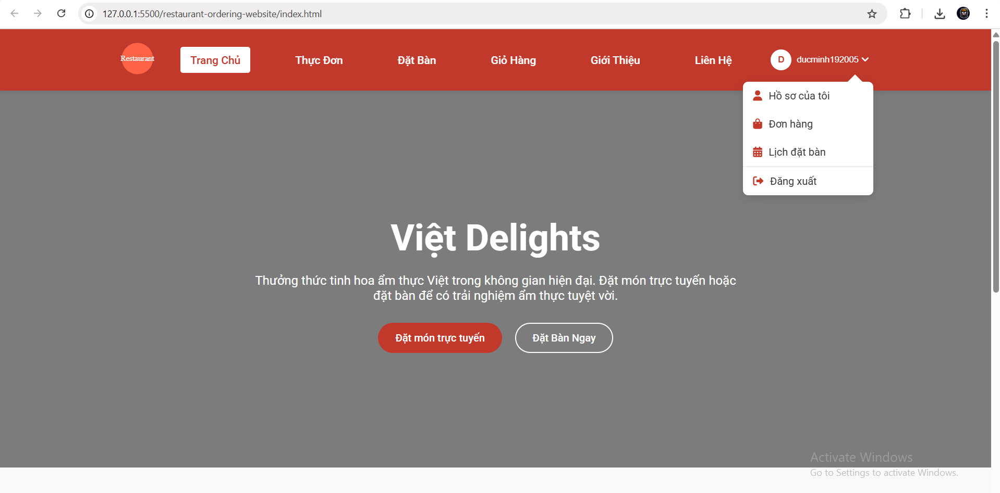
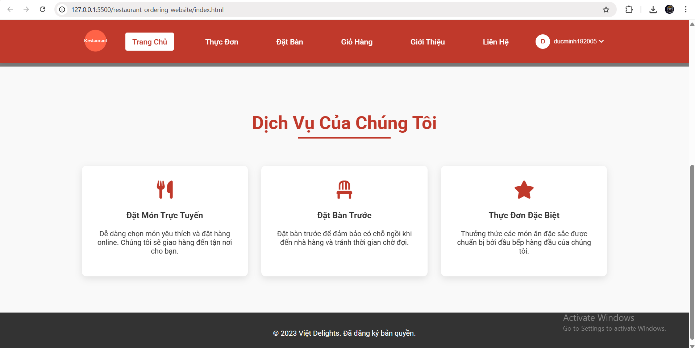
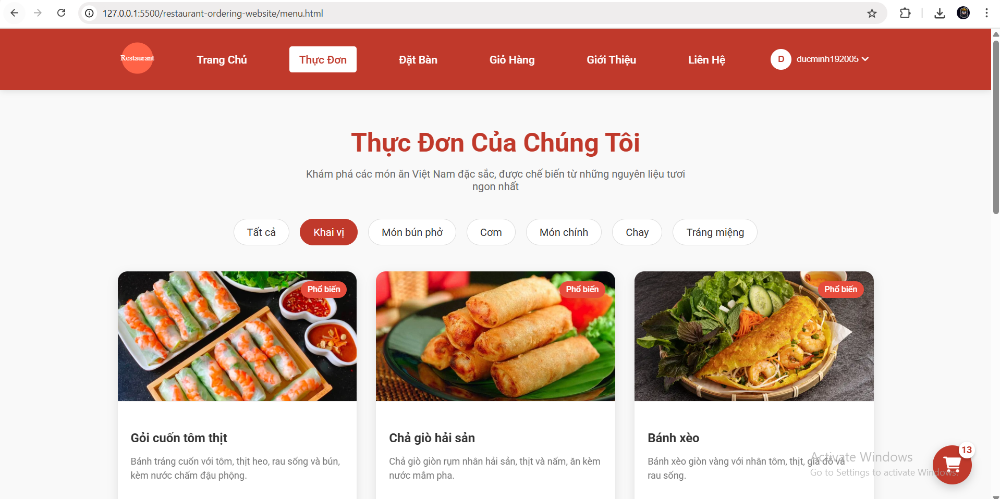
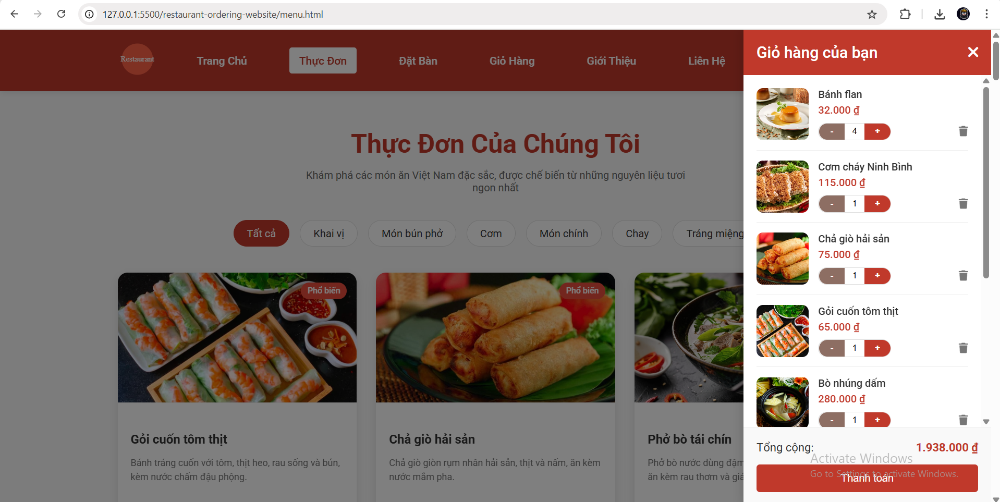
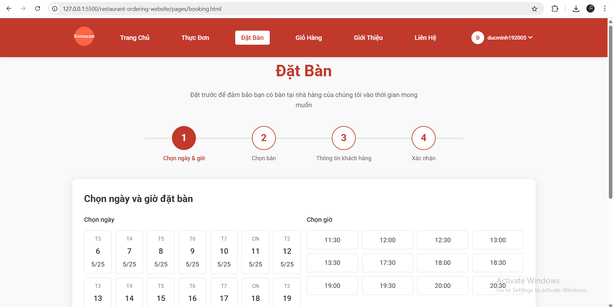
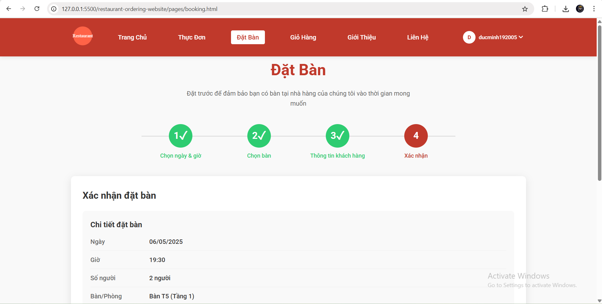
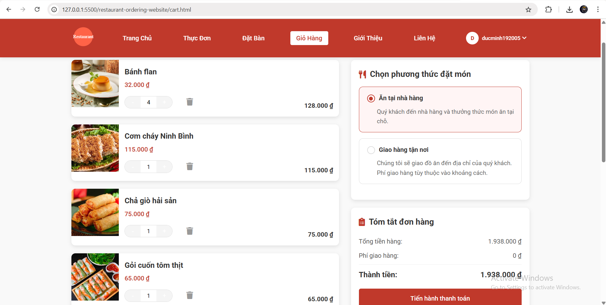
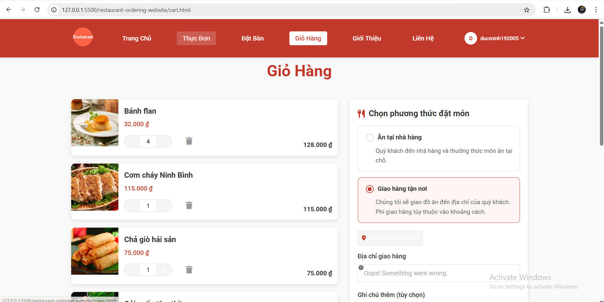

# 🍽️ Website Đặt Món & Đặt Bàn Nhà Hàng

[](https://www.w3.org/html/)
[](https://www.w3.org/Style/CSS/)
[](https://www.ecma-international.org/ecma-262/)
[](https://en.wikipedia.org/wiki/Responsive_web_design)

## 📋 Tổng quan
Dự án này là một ứng dụng web hiện đại cho nhà hàng, cung cấp trải nghiệm đặt món trực tuyến và đặt bàn liền mạch. Khách hàng có thể dễ dàng duyệt qua thực đơn, thêm món vào giỏ hàng và lựa chọn giữa giao hàng hoặc đặt bàn để thưởng thức tại nhà hàng.

## ✨ Tính Năng Chính

- **🛒 Đặt Món Trực Tuyến** - Duyệt thực đơn đầy đủ và đặt hàng để giao đến tận nơi
- **📅 Đặt Bàn** - Đặt chỗ trước với lựa chọn ngày, giờ và số lượng khách linh hoạt
- **🧺 Giỏ Hàng Thông Minh** - Quản lý lựa chọn món ăn và tiến hành thanh toán dễ dàng
- **📱 Thiết Kế Responsive** - Trải nghiệm người dùng mượt mà trên mọi thiết bị
- **✨ Hiệu Ứng Tinh Tế** - Các animation và chuyển đổi mượt mà nâng cao trải nghiệm duyệt web

## 🖼️ Demo & Trải Nghiệm Người Dùng

Dưới đây là hình ảnh minh họa các tính năng chính của ứng dụng:

<div align="center">

### 🏠 Trang Chủ
<p>
  
  
</p>

### 🍔 Trang Thực Đơn
<p>
  
  
</p>

### 🪑 Trang Đặt Bàn
<p>
  
  
</p>

### 🛒 Trang Giỏ Hàng
<p>
  
  
</p>

</div>

## Cấu Trúc Dự Án
restaurant-ordering-website
├── assets
│   ├── css
│   │   ├── main.css        # Main styles for layout and typography
│   │   ├── menu.css        # Styles specific to the menu page
│   │   ├── booking.css      # Styles for the booking page
│   │   └── animations.css   # CSS transitions and animations
│   ├── js
│   │   ├── main.js         # Main JavaScript file for global events
│   │   ├── menu.js         # JavaScript functions for the menu page
│   │   ├── cart.js         # Shopping cart functionality
│   │   ├── booking.js      # Booking functionality
│   │   └── animations.js    # JavaScript for triggering animations
│   └── images
│       └── logo.svg        # Logo image for the restaurant
├── pages
│   ├── menu.html           # HTML structure for the menu page
│   ├── booking.html        # HTML structure for the booking page
│   ├── cart.html           # HTML structure for the shopping cart page
│   ├── checkout.html       # HTML structure for the checkout page
│   └── confirmation.html    # HTML structure for the confirmation page
├── index.html              # Main entry point of the website
├── about.html              # Information about the restaurant
├── contact.html            # Contact information and form
└── README.md               # Project documentation
```

## Setup Instructions

1. Clone the repository to your local machine.
2. Open the `index.html` file in your web browser to view the website.
3. Ensure you have a local server running if you want to test the JavaScript functionalities.

## Technologies Used


- HTML
- CSS
- JavaScript

## Contributing

Feel free to fork the repository and submit pull requests for any improvements or features you would like to add.

