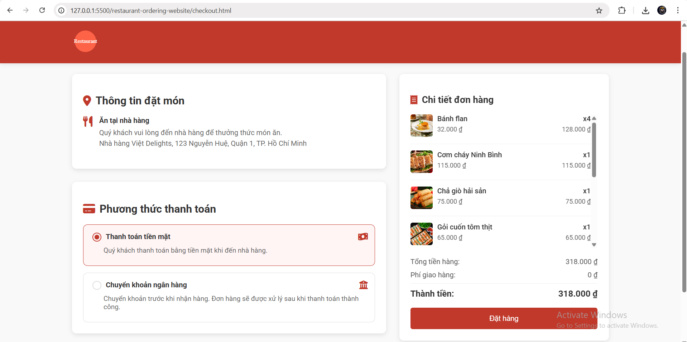
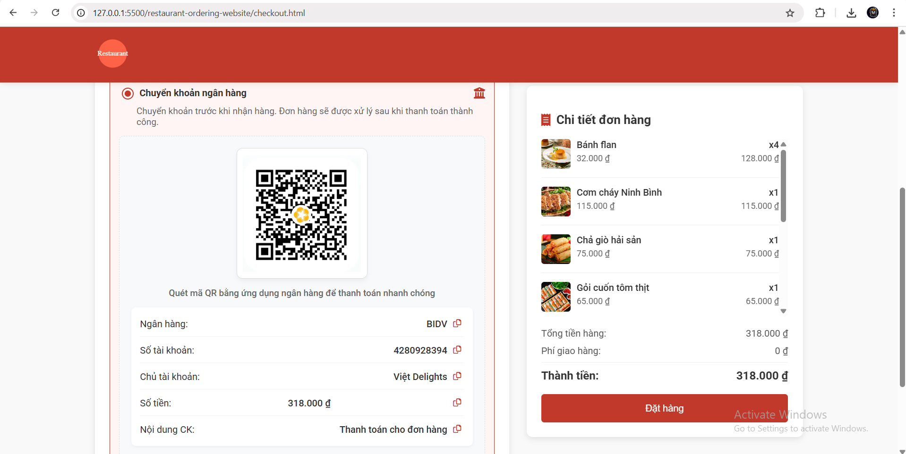

# Website Đặt Món & Đặt Bàn Nhà Hàng

Dự án này là một ứng dụng web cho nhà hàng cho phép người dùng đặt món ăn trực tuyến và đặt bàn. Người dùng có thể duyệt thực đơn, thêm món ăn vào giỏ hàng và lựa chọn giao hàng hoặc đặt bàn để dùng bữa tại nhà hàng.

## Tính Năng

- **Đặt Món Trực Tuyến**: Người dùng có thể xem thực đơn và đặt món để giao hàng.
- **Đặt Bàn**: Người dùng có thể đặt bàn trước, chọn ngày, giờ và số lượng khách.
- **Giỏ Hàng**: Người dùng có thể thêm món vào giỏ hàng, xem lựa chọn của họ và tiến hành thanh toán.
- **Thiết Kế Responsive**: Website được thiết kế thân thiện với thiết bị di động, đảm bảo trải nghiệm người dùng tốt trên mọi thiết bị.
- **Hiệu Ứng**: Các hiệu ứng chuyển đổi và animation mượt mà nâng cao trải nghiệm người dùng xuyên suốt website.

## Demo

Dưới đây là một số hình ảnh demo của website:

### Trang Chủ
 

### Trang Thực Đơn
 

### Trang Đặt Bàn
 

### Trang Giỏ Hàng
 

### Trang Thanh Toán
 

## Cấu Trúc Dự Án

```
restaurant-ordering-website
├── assets
│   ├── css
│   │   ├── main.css        # Main styles for layout and typography
│   │   ├── menu.css        # Styles specific to the menu page
│   │   ├── booking.css      # Styles for the booking page
│   │   └── animations.css   # CSS transitions and animations
│   ├── js
│   │   ├── main.js         # Main JavaScript file for global events
│   │   ├── menu.js         # JavaScript functions for the menu page
│   │   ├── cart.js         # Shopping cart functionality
│   │   ├── booking.js      # Booking functionality
│   │   └── animations.js    # JavaScript for triggering animations
│   └── images
│       └── logo.svg        # Logo image for the restaurant
├── pages
│   ├── menu.html           # HTML structure for the menu page
│   ├── booking.html        # HTML structure for the booking page
│   ├── cart.html           # HTML structure for the shopping cart page
│   ├── checkout.html       # HTML structure for the checkout page
│   └── confirmation.html    # HTML structure for the confirmation page
├── index.html              # Main entry point of the website
├── about.html              # Information about the restaurant
├── contact.html            # Contact information and form
└── README.md               # Project documentation
```

## Hướng Dẫn Cài Đặt

1. Clone repository về máy của bạn.
2. Mở file `index.html` trong trình duyệt web để xem website.
3. Đảm bảo bạn có một server local đang chạy nếu bạn muốn kiểm tra các chức năng JavaScript.

## Công Nghệ Sử Dụng

- HTML
- CSS
- JavaScript

## Đóng Góp

Hãy thoải mái fork repository và gửi pull request cho bất kỳ cải tiến hoặc tính năng nào bạn muốn thêm vào.
